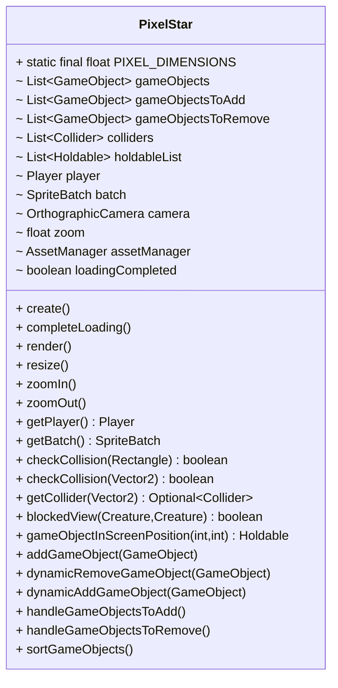

# PixelStar class

The PixelStar class is the application class, that manages all the GameObjects on the screen.

```mermaid
classDiagram
class PixelStar{
    + static final float PIXEL_DIMENSIONS
    ~ List~GameObject~ gameObjects
    ~ List~GameObject~ gameObjectsToAdd
    ~ List~GameObject~ gameObjectsToRemove
    ~ List~Collider~ colliders
    ~ List~Holdable~ holdableList
    ~ Player player
    ~ SpriteBatch batch
    ~ OrthographicCamera camera
    ~ float zoom
    ~ AssetManager assetManager
    ~ boolean loadingCompleted
    + create()
    + completeLoading()
    + render()
    + resize()
    + zoomIn()
    + zoomOut()
    + getPlayer() Player
    + getBatch() SpriteBatch
    + checkCollision(Rectangle) boolean
    + checkCollision(Vector2) boolean
    + getCollider(Vector2) Optional~Collider~
    + blockedView(Creature,Creature) boolean
    + gameObjectInScreenPosition(int,int) Holdable
    + addGameObject(GameObject)
    + dynamicRemoveGameObject(GameObject)
    + dynamicAddGameObject(GameObject)
    + handleGameObjectsToAdd()
    + handleGameObjectsToRemove()
    + sortGameObjects()
}
```