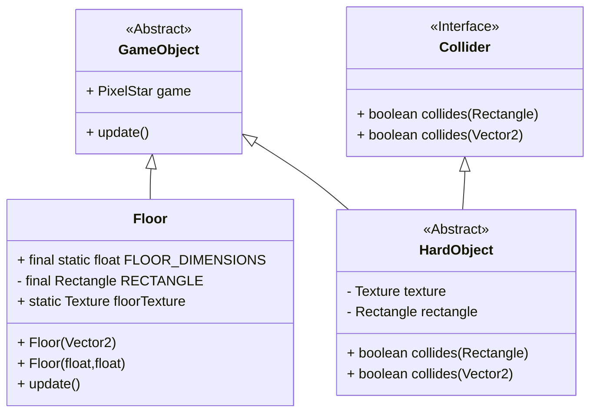

# GameObject package

This package contains the GameObject abstract class, representing all the objects in the game that will be rendered on
screen and its son classes.

```mermaid
classDiagram
class GameObject {
    <<Abstract>>
    + PixelStar game
    + update()
}
class Floor {
    + final static float FLOOR_DIMENSIONS
    - final Rectangle RECTANGLE
    + static Texture floorTexture
    + Floor(Vector2)
    + Floor(float,float)
    + update()
}
GameObject <|-- Floor
class Collider {
    <<Interface>>
    + boolean collides(Rectangle)
    + boolean collides(Vector2)
}
class HardObject {
    <<Abstract>>
    - Texture texture
    - Rectangle rectangle
    + boolean collides(Rectangle)
    + boolean collides(Vector2)
}
GameObject <|-- HardObject
Collider <|-- HardObject
```