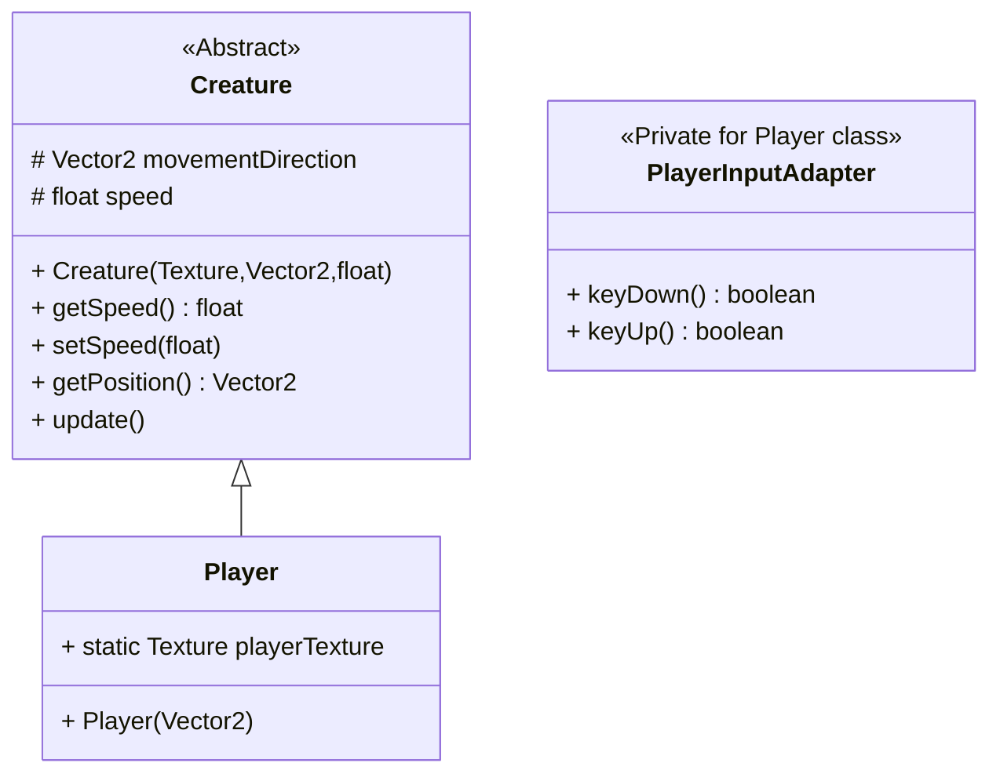

# Creature package

This package will contain the Creature class, son of HardObject class, and its son classes; Creatures will be both
friends and enemies, and also the Player class will be son of Creature

