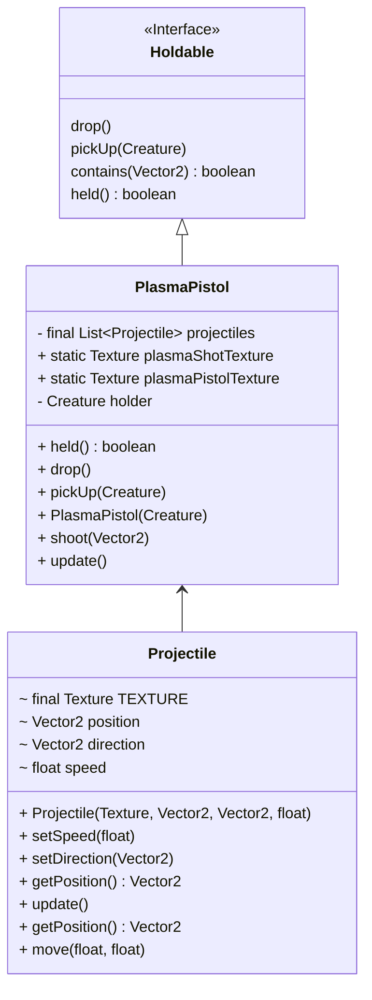

# Weapons package

This package contains the class for the Weapons that the player and the enemies will use.

```mermaid
classDiagram
class Holdable {
   <<Interface>>
   drop()
   pickUp(Creature)
   contains(Vector2) boolean
   held() boolean
}
class PlasmaPistol {
    - final List~Projectile~ projectiles
    + static Texture plasmaShotTexture
    + static Texture plasmaPistolTexture
    - Creature holder
    + held() boolean
    + drop()
    + pickUp(Creature)
    + PlasmaPistol(Creature)
    + shoot(Vector2)
    + update()
}
Holdable <|-- PlasmaPistol
class Projectile {
    ~ final Texture TEXTURE
    ~ Vector2 position
    ~ Vector2 direction
    ~ float speed
    + Projectile(Texture, Vector2, Vector2, float)
    + setSpeed(float)
    + setDirection(Vector2)
    + getPosition() Vector2
    + update()
    + getPosition() Vector2
    + move(float, float)
}
PlasmaPistol <-- Projectile
```