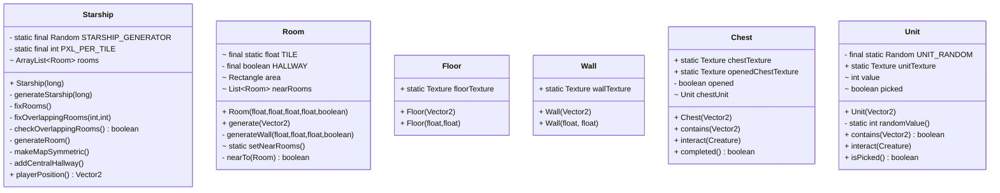

# Terrain package
This package contains classes to generate the map and its contents

```mermaid
classDiagram
class Starship{
    - static final Random STARSHIP_GENERATOR
    - static final int PXL_PER_TILE
    ~ ArrayList~Room~ rooms
    + Starship(long)
    - generateStarship(long)
    - fixRooms()
    - fixOverlappingRooms(int,int)
    - checkOverlappingRooms() boolean
    - generateRoom()
    - makeMapSymmetric()
    - addCentralHallway()
    + playerPosition() Vector2
}
class Room {
    ~ final static float TILE
    - final boolean HALLWAY
    ~ Rectangle area
    ~ List~Room~ nearRooms
    + Room(float,float,float,float,boolean)
    + generate(Vector2)
    - generateWall(float,float,float,boolean)
    ~ static setNearRooms()
    - nearTo(Room) boolean
}
class Floor {
    + static Texture floorTexture
    + Floor(Vector2)
    + Floor(float,float)
}
class Wall {
    + static Texture wallTexture
    + Wall(Vector2)
    + Wall(float, float)
}
class Chest {
    + static Texture chestTexture
    + static Texture openedChestTexture
    - boolean opened
    ~ Unit chestUnit
    + Chest(Vector2)
    + contains(Vector2)
    + interact(Creature)
    + completed() boolean
}
class Unit {
    - final static Random UNIT_RANDOM
    + static Texture unitTexture
    ~ int value
    ~ boolean picked
    + Unit(Vector2)
    - static int randomValue()
    + contains(Vector2) boolean
    + interact(Creature)
    + isPicked() boolean
}
```